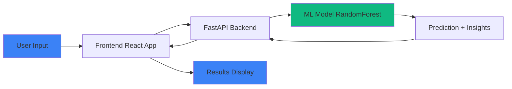

# EV Charging Demand Forecasting

> **Intelligent energy consumption prediction for electric vehicle charging using Machine Learning**


---

## 🎯 What This Project Does

This application predicts **how much energy (in kWh) an electric vehicle will consume** during a charging session based on various parameters like battery capacity, charging rate, temperature, and vehicle characteristics.

### The Problem We Solve

Electric vehicle adoption is growing rapidly, but charging stations face challenges:
- **Unpredictable energy demand** makes load management difficult
- **Peak demand periods** can overload the grid
- **Inefficient planning** leads to higher operational costs
- **Users lack insights** on optimal charging strategies

### Our Solution

Using **Machine Learning (RandomForest Regression)**, we analyze historical charging patterns to:
- ✅ Predict energy consumption accurately
- ✅ Estimate charging costs in real-time
- ✅ Calculate environmental impact (CO₂ savings vs gasoline)
- ✅ Provide smart recommendations for optimal charging times
- ✅ Help charging stations manage grid load efficiently

---

## 🚀 Key Features

### 1. **Energy Prediction**
- Accurate kWh consumption forecasting
- Based on 10 input parameters
- Trained on 1,254 real charging sessions

### 2. **Smart Insights**
- 💰 **Cost Estimation** - Calculate charging costs ($0.13/kWh average)
- 🌱 **Environmental Impact** - CO₂ savings compared to gasoline vehicles
- ⏱️ **Time Estimation** - Predicted charging duration
- 📊 **Historical Tracking** - Save and compare past predictions

### 3. **Intelligent Recommendations**
- Peak vs off-peak charging guidance
- Temperature impact analysis
- Charger type optimization
- Battery health tips

### 4. **Data Visualization**
- Interactive prediction trend charts
- Real-time statistics dashboard
- History analytics with CSV export

---

## 🛠️ Tech Stack

### **Frontend** (React SPA)
| Technology | Purpose | Version |
|------------|---------|---------|
| **React** | UI Framework | 18.x |
| **Vite** | Build Tool & Dev Server | 7.x |
| **Framer Motion** | Animations & Transitions | Latest |
| **Recharts** | Data Visualization | Latest |
| **React Hot Toast** | Notifications | Latest |
| **Lucide React** | Icon Library | Latest |
| **Axios** | HTTP Client | Latest |
| **date-fns** | Date Formatting | Latest |

**Design System:**
- CSS Custom Properties (4-color dark theme)
- Glassmorphism effects with backdrop-filter
- Responsive grid layout
- Mobile-first approach

### **Backend** (Python API)
| Technology | Purpose | Version |
|------------|---------|---------|
| **FastAPI** | REST API Framework | Latest |
| **Uvicorn** | ASGI Server | Latest |
| **Pandas** | Data Processing | Latest |
| **Scikit-learn** | ML Model | Latest |
| **Joblib** | Model Serialization | Latest |
| **Pydantic** | Data Validation | Latest |

### **Machine Learning**
- **Algorithm**: RandomForest Regressor
- **Training Samples**: 1,254 charging sessions
- **Features**: 10 parameters
  - Battery Capacity (kWh)
  - Charging Duration (hours)
  - Charging Rate (kW)
  - Distance Driven (km)
  - Temperature (°C)
  - State of Charge - Start & End (%)
  - Vehicle Age (years)
  - Start Hour (0-23)
  - Charger Type (Level 1/2, DC Fast)

- **Model Performance**: 
  - N Estimators: 200 trees
  - Random State: 42 (reproducible)
  - Train/Test Split: 80/20

---

## 📊 How It Works



1. **User enters charging parameters** (battery size, charger type, temperature, etc.)
2. **Frontend sends request** to FastAPI backend
3. **Backend preprocesses data** and feeds to ML model
4. **RandomForest model predicts** energy consumption
5. **Insights module calculates** cost, CO₂ savings, recommendations
6. **Results displayed** with circular gauge, charts, and smart tips

---

## 🎨 Design Philosophy

**4-Color Dark Theme:**
- `#0f172a` - Deep space blue (primary background)
- `#3b82f6` - Electric blue (energy theme)
- `#10b981` - Emerald green (eco-friendly)
- `#94a3b8` - Slate (text & UI elements)

**UI Features:**
- Glassmorphism with backdrop blur
- Smooth Framer Motion animations
- Responsive mobile-first design
- Accessible color contrast
- Modern micro-interactions

---

## 🚦 Getting Started

### Prerequisites
- **Python 3.8+**
- **Node.js 16+** and npm
- Git

### Installation

**1. Clone the repository**
```bash
git clone https://github.com/koradee/EV_Charging-Demand-Forecasting.git
cd EV_Charging-Demand-Forecasting-main
```

**2. Backend Setup**
```bash
# Install Python dependencies
pip install pandas scikit-learn fastapi uvicorn joblib

# Start the API server
python backend/main.py
```
✅ Backend runs at `http://127.0.0.1:8000`

**3. Frontend Setup**
```bash
cd frontend

# Install Node dependencies
npm install

# Start development server
npm run dev
```
✅ Frontend runs at `http://localhost:5173`

---

## 📖 Usage

### Web Interface
1. Open `http://localhost:5173` in your browser
2. Fill in the charging parameters:
   - Battery capacity, charging rate, duration
   - Distance driven, temperature
   - State of charge (start/end)
   - Vehicle age, start hour, charger type
3. Click **"Predict Energy Consumption"**
4. View results:
   - Energy consumption prediction
   - Cost estimation
   - CO₂ savings
   - Charging time
   - Smart recommendations
5. Track history and export to CSV

### API Endpoints

**Interactive Documentation:** `http://127.0.0.1:8000/docs`

| Endpoint | Method | Description |
|----------|--------|-------------|
| `/` | GET | API info and available endpoints |
| `/predict` | POST | Single prediction with insights |
| `/batch-predict` | POST | Multiple predictions |
| `/stats` | GET | Model metadata and statistics |
| `/recommendations` | POST | Get charging tips |

**Example API Request:**
```bash
curl -X POST "http://127.0.0.1:8000/predict" \
  -H "Content-Type: application/json" \
  -d '{
    "battery_capacity": 75.0,
    "charging_duration": 2.5,
    "charging_rate": 25.0,
    "distance_driven": 150.0,
    "temperature": 20.0,
    "soc_start": 30.0,
    "soc_end": 80.0,
    "vehicle_age": 3.0,
    "start_hour": 12,
    "charger_type": "Level 2"
  }'
```

---

## 📁 Project Structure

```
EV_Charging-Demand-Forecasting-main/
├── backend/
│   ├── main.py              # FastAPI application
│   ├── train_model.py       # Model training script
│   ├── insights.py          # Cost, CO₂, recommendations
│   ├── model.pkl            # Trained ML model
│   └── encoder.pkl          # Label encoder
├── frontend/
│   ├── src/
│   │   ├── components/       # React components
│   │   │   ├── GlassCard.jsx
│   │   │   ├── StatsCard.jsx
│   │   │   ├── FormSection.jsx
│   │   │   ├── ResultsPanel.jsx
│   │   │   ├── PredictionChart.jsx
│   │   │   └── HistoryPanel.jsx
│   │   ├── App.jsx           # Main application
│   │   ├── index.css         # Design system
│   │   └── main.jsx          # Entry point
│   └── package.json
├── ev_charging_patterns.csv  # Training dataset
├── EV_Charging_Demand_Forecasting.ipynb  # Jupyter notebook
└── README.md
```

---

## 🎓 Model Training

To retrain the model with updated data:

```bash
python backend/train_model.py
```

This will:
1. Load `ev_charging_patterns.csv`
2. Preprocess data (handle missing values, encode categories)
3. Train RandomForest with 200 estimators
4. Save model and encoder to `backend/`

---

## 🌟 Future Enhancements

- [ ] Multi-model comparison (XGBoost, Neural Networks)
- [ ] Real-time grid load integration
- [ ] Mobile app (React Native)
- [ ] User authentication & profiles
- [ ] Dynamic pricing based on grid demand
- [ ] Solar panel integration recommendations

---

## 📄 License

MIT License - feel free to use this project for learning and commercial purposes.

---

## 👥 Contributing

Contributions welcome! Please:
1. Fork the repository
2. Create a feature branch
3. Commit your changes
4. Push to the branch
5. Open a Pull Request

---

## 📞 Contact

**GitHub:** [@koradee](https://github.com/koradee)

**Project Link:** [EV Charging Demand Forecasting](https://github.com/koradee/EV_Charging-Demand-Forecasting)

---

## 🙏 Acknowledgments

- Dataset inspired by real-world EV charging patterns
- Built with modern web technologies
- Designed for scalability and user experience

**Made with ⚡ for a sustainable future**
