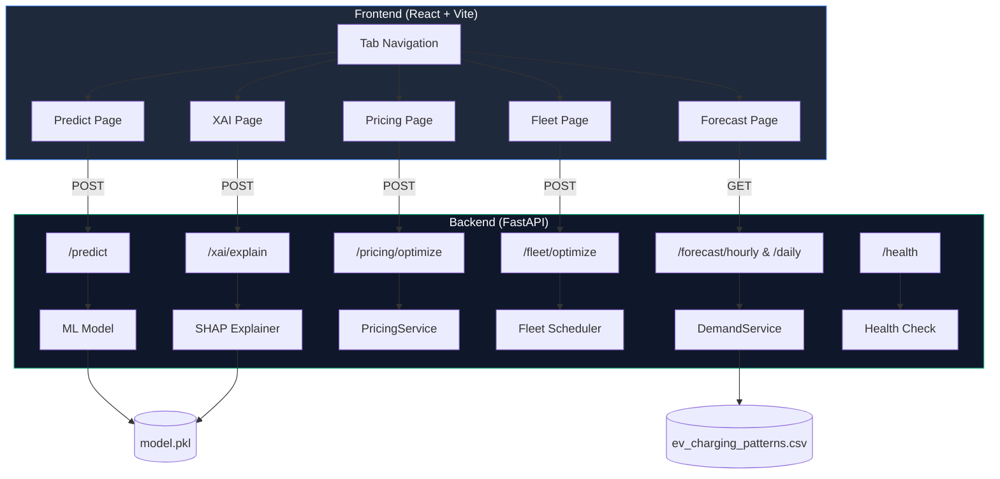

# ⚡ EV Charging AI Platform

> **AI-powered energy prediction, demand forecasting, dynamic pricing, fleet optimization & explainable AI — all in one platform.**


---

## 🎯 What This Project Does

This platform tackles the **real-world challenge** of unpredictable EV charging demand by combining **Machine Learning** with a modern full-stack application. It doesn't just predict energy — it provides a complete charging intelligence suite.

### The Problem

Electric vehicle adoption is growing rapidly, but charging infrastructure faces critical challenges:

- **Unpredictable energy demand** makes grid load management difficult
- **Peak demand periods** risk overloading the electrical grid
- **Inefficient pricing** leads to higher costs for consumers and operators
- **Fleet operators** struggle to schedule charging for multiple vehicles
- **Black-box ML models** make it hard to trust predictions

### Our Solution — 5 Integrated Modules

| Module | What It Does |
|--------|-------------|
| 🔮 **Predictive Analytics** | Forecast energy consumption (kWh) for any charging session |
| 📊 **Demand Forecasting** | Visualize hourly & daily demand profiles from historical data |
| 💰 **Dynamic Pricing** | Find the cheapest charging window using Time-of-Use tariff simulation |
| 🚛 **Fleet Optimization** | Schedule charging for multiple vehicles using EDF strategy |
| 🧠 **Explainable AI** | Understand *why* predictions are made with SHAP feature importance |

---

## 🚀 Key Features

### 1. Energy Prediction
- Accurate kWh consumption forecasting using RandomForest Regression
- Based on **10 input parameters** (battery, charger, temperature, vehicle age, etc.)
- Trained on **1,254 real charging sessions**
- Real-time cost estimation, CO₂ savings calculation, and smart recommendations

### 2. Demand Forecasting Dashboard
- **Hourly demand profile** — interactive area chart showing energy patterns across 24 hours
- **Daily demand profile** — bar chart comparing weekday vs weekend consumption
- Summary statistics: peak hour, peak demand, total sessions analyzed

### 3. Dynamic Pricing Optimizer
- **Time-of-Use (TOU) tariff simulation** with peak ($0.35/kWh) vs off-peak ($0.12/kWh) rates
- **24-hour cost chart** — color-coded bars (🟢 optimal, 🔴 peak, 🔵 off-peak)
- Calculates exact savings between current time and cheapest window

### 4. Fleet Optimizer
- **Multi-vehicle scheduling** — add/remove vehicles with arrival, departure, and energy needs
- **Earliest Departure First (EDF)** scheduling algorithm
- **Animated 24h timeline** — visual Gantt-style view of each vehicle's charging window
- Grid capacity constraints

### 5. Explainable AI (SHAP)
- **SHAP TreeExplainer** for RandomForest model interpretation
- **Horizontal waterfall chart** — green (pushes prediction up) / blue (pushes prediction down)
- **Auto-generated insight narratives** — "Battery Capacity has the strongest impact: +4.23 kWh"
- Builds trust in ML predictions by making them transparent

### 6. Smart Insights (Every Prediction)
- 💰 **Cost Estimation** — based on $0.13/kWh US average
- 🌱 **CO₂ Savings** — vs gasoline equivalent (EPA: 0.21 kg CO₂/km)
- ⏱️ **Charging Time** — estimated duration at given rate
- 📊 **Historical Tracking** — save, compare, and export predictions as CSV

---

## 🛠️ Tech Stack

### Frontend (React SPA)

| Technology | Purpose | Version |
|------------|---------|---------|
| **React** | UI Framework | 19.x |
| **Vite** | Build Tool & Dev Server | 7.x |
| **Framer Motion** | Animations & Page Transitions | 12.x |
| **Recharts** | Data Visualization (Area, Bar, Line charts) | 3.x |
| **React Hot Toast** | Notification System | 2.x |
| **Lucide React** | Premium Icon Library | Latest |
| **Axios** | HTTP Client | Latest |
| **date-fns** | Date Formatting | 4.x |

**Design System:**
- CSS Custom Properties (4-color dark theme)
- Glassmorphism effects with `backdrop-filter`
- Google Fonts (Inter) typography
- Responsive mobile-first layout
- Tab-based navigation with animated indicators

### Backend (Python API)

| Technology | Purpose | Version |
|------------|---------|---------|
| **FastAPI** | REST API Framework | 0.95+ |
| **Uvicorn** | ASGI Server | 0.21+ |
| **Pandas** | Data Processing | 3.x |
| **Scikit-learn** | ML Model (RandomForest) | 1.8+ |
| **SHAP** | Explainable AI | 0.51+ |
| **Joblib** | Model Serialization | 1.5+ |
| **Pydantic** | Request/Response Validation | 1.10+ |
| **Gunicorn** | Production WSGI Server | 20.x |

### Machine Learning

- **Algorithm:** RandomForest Regressor (200 estimators)
- **Explainability:** SHAP TreeExplainer
- **Training Data:** 1,254 charging sessions
- **Features:** 10 parameters
  - Battery Capacity (kWh), Charging Duration (hours), Charging Rate (kW)
  - Distance Driven (km), Temperature (°C)
  - State of Charge — Start & End (%)
  - Vehicle Age (years), Start Hour (0–23), Charger Type (Level 1/2, DC Fast)
- **Train/Test Split:** 80/20, Random State: 42

### DevOps

| Technology | Purpose |
|------------|---------|
| **Docker** | Containerized deployment (multi-stage builds) |
| **Docker Compose** | Multi-service orchestration |
| **Nginx** | Production frontend serving |
| **Render** | Cloud hosting (free tier) |

---

## 📊 Architecture



### Data Flow

1. **User selects a tab** → Predict, Forecast, Pricing, Fleet, or Explainability
2. **Frontend sends request** to the appropriate FastAPI endpoint
3. **Backend processes** using ML model, aggregation, or optimization logic
4. **Response includes** predictions, insights, recommendations, or visualizations
5. **Frontend renders** results with animated charts, gauges, and timelines

---

## 🎨 Design System

**4-Color Dark Theme:**

| Color | Hex | Usage |
|-------|-----|-------|
| Deep Space Blue | `#0f172a` | Primary background |
| Electric Blue | `#3b82f6` | Energy theme, accents, links |
| Emerald Green | `#10b981` | Success, eco-friendly, positive |
| Slate | `#94a3b8` | Text, UI elements, borders |

**UI Features:**
- Glassmorphism cards with `backdrop-filter: blur(12px)`
- Framer Motion page transitions (AnimatePresence)
- Animated tab indicator with `layoutId`
- Circular gauge for energy prediction display
- Responsive grids (mobile-first)
- Custom scrollbar styling
- Loading skeletons and spinner states

---

## 🚦 Getting Started

### Prerequisites

- **Python 3.8+**
- **Node.js 16+** and npm
- Git

### Installation

**1. Clone the repository**

```bash
git clone https://github.com/koradee/EV_Charging-Demand-Forecasting.git
cd EV_Charging-Demand-Forecasting-main
```

**2. Backend Setup**

```bash
# Install Python dependencies
pip install -r requirements.txt

# Start the API server
python backend/main.py
```

✅ Backend runs at `http://127.0.0.1:8000`

**3. Frontend Setup**

```bash
cd frontend

# Install Node dependencies
npm install

# Start development server
npm run dev
```

✅ Frontend runs at `http://localhost:5173`

**4. Open in browser**

Navigate to `http://localhost:5173` and explore all 5 tabs!

---

## 📖 Usage Guide

### Tab 1: Predict

1. Fill in charging parameters (battery capacity, charger type, temperature, etc.)
2. Click **"Predict Energy Consumption"**
3. View results: energy gauge, cost, CO₂ savings, charging time, recommendation
4. Track prediction history and export to CSV

### Tab 2: Forecast

- Auto-loads hourly and daily demand profiles from historical data
- Identify peak demand hours and day-of-week patterns
- Use the **Refresh** button to reload data

### Tab 3: Pricing

1. Enter energy needed (kWh), duration, and current start hour
2. Click **"Find Cheapest Time"**
3. See color-coded 24-hour cost chart (green = cheapest, red = peak)
4. Compare current cost vs optimal cost and savings

### Tab 4: Fleet

1. Add vehicles with arrival hour, departure hour, and energy needed
2. Set max grid capacity
3. Click **"Optimize Schedule"**
4. View animated timeline showing each vehicle's charging window

### Tab 5: Explainability

1. Set input parameters on the Predict tab first
2. Switch to Explainability tab
3. Click **"Explain Prediction"**
4. View SHAP waterfall chart showing which features push the prediction up/down
5. Read auto-generated insight narratives

---

## 🔌 API Reference

**Interactive Documentation:** `http://127.0.0.1:8000/docs`

| Endpoint | Method | Description |
|----------|--------|-------------|
| `/` | GET | API info and available modules |
| `/health` | GET | Health check (model status, version) |
| `/predict` | POST | Single energy prediction with insights |
| `/batch-predict` | POST | Multiple predictions in one request |
| `/stats` | GET | Model metadata and statistics |
| `/recommendations` | POST | Charging tips without prediction |
| `/forecast/hourly` | GET | Aggregated hourly demand profile |
| `/forecast/daily` | GET | Aggregated daily demand profile |
| `/pricing/optimize` | POST | Find cheapest charging window |
| `/fleet/optimize` | POST | Schedule fleet charging |
| `/xai/explain` | POST | SHAP feature importance |

### Example: Predict Energy

```bash
curl -X POST "http://127.0.0.1:8000/predict" \
  -H "Content-Type: application/json" \
  -d '{
    "battery_capacity": 75.0,
    "charging_duration": 2.5,
    "charging_rate": 25.0,
    "distance_driven": 150.0,
    "temperature": 20.0,
    "soc_start": 30.0,
    "soc_end": 80.0,
    "vehicle_age": 3.0,
    "start_hour": 12,
    "charger_type": "Level 2"
  }'
```

### Example: Find Cheapest Charging Time

```bash
curl -X POST "http://127.0.0.1:8000/pricing/optimize" \
  -H "Content-Type: application/json" \
  -d '{
    "energy_kwh": 40.0,
    "duration_hours": 3.0,
    "current_start_hour": 17
  }'
```

---

## 📁 Project Structure

```
EV_Charging-Demand-Forecasting-main/
├── backend/
│   ├── main.py                    # FastAPI app + core endpoints
│   ├── train_model.py             # Model training script
│   ├── insights.py                # Cost, CO₂, recommendations
│   ├── model.pkl                  # Trained RandomForest model
│   ├── encoder.pkl                # Label encoder for charger types
│   ├── routers/
│   │   ├── forecasting.py         # /forecast/* endpoints
│   │   ├── pricing.py             # /pricing/* endpoints
│   │   ├── fleet.py               # /fleet/* endpoints
│   │   └── xai.py                 # /xai/* endpoints
│   └── services/
│       ├── demand_service.py      # Hourly/daily demand aggregation
│       ├── pricing_service.py     # TOU tariff optimization
│       ├── fleet_service.py       # Fleet scheduling logic
│       └── xai_service.py         # SHAP explainer
├── frontend/
│   ├── src/
│   │   ├── components/
│   │   │   ├── TabNav.jsx         # 5-tab navigation
│   │   │   ├── FormSection.jsx    # Prediction input form
│   │   │   ├── ResultsPanel.jsx   # Prediction results + gauge
│   │   │   ├── PredictionChart.jsx# Trend chart
│   │   │   ├── HistoryPanel.jsx   # Prediction history + CSV export
│   │   │   ├── StatsCard.jsx      # Stats display cards
│   │   │   ├── GlassCard.jsx      # Glassmorphism card wrapper
│   │   │   ├── ForecastPage.jsx   # Demand forecast dashboard
│   │   │   ├── PricingPage.jsx    # Dynamic pricing optimizer
│   │   │   ├── FleetPage.jsx      # Fleet scheduling UI
│   │   │   └── XAIPage.jsx        # SHAP explainability page
│   │   ├── App.jsx                # Main app with tab routing
│   │   ├── index.css              # Complete design system
│   │   └── main.jsx               # Entry point
│   ├── index.html                 # SEO-optimized HTML
│   └── package.json
├── ev_charging_patterns.csv       # Training dataset (1,254 sessions)
├── EV_Charging_Demand_Forecasting.ipynb  # Jupyter notebook (EDA + training)
├── requirements.txt               # Python dependencies
├── Dockerfile.backend             # Backend container
├── Dockerfile.frontend            # Multi-stage frontend container
├── docker-compose.yml             # Orchestration
├── nginx.conf                     # Production nginx config
├── .dockerignore                  # Docker build exclusions
├── DEPLOYMENT.md                  # Deployment guide
└── README.md                      # This file
```

---

## 🐳 Docker Deployment

```bash
# Build and run both services
docker-compose up --build -d

# Access
# Frontend: http://localhost:3000
# Backend:  http://localhost:8000

# Stop
docker-compose down
```

For cloud deployment (Render, Railway, etc.), see [DEPLOYMENT.md](DEPLOYMENT.md).

---

## 🎓 Model Training

To retrain the model with updated data:

```bash
python backend/train_model.py
```

This will:
1. Load `ev_charging_patterns.csv`
2. Preprocess data (handle missing values, encode categories, extract hour)
3. Train RandomForest with 200 estimators
4. Save `model.pkl` and `encoder.pkl` to `backend/`

---

## 🌟 Future Enhancements

- [ ] Multi-model comparison (XGBoost, LightGBM, Neural Networks)
- [ ] JWT authentication & user profiles
- [ ] PostgreSQL database for persistent prediction storage
- [ ] Real-time grid load integration via WebSocket
- [ ] Interactive charging station map (Leaflet/Mapbox)
- [ ] CI/CD pipeline (GitHub Actions)
- [ ] Model monitoring & drift detection
- [ ] PDF report generation
- [ ] Mobile app (React Native)

---

## 📄 License

MIT License — free for learning and commercial use.

---

## 👥 Contributing

Contributions welcome! Please:
1. Fork the repository
2. Create a feature branch (`git checkout -b feature/amazing-feature`)
3. Commit your changes (`git commit -m 'Add amazing feature'`)
4. Push to the branch (`git push origin feature/amazing-feature`)
5. Open a Pull Request

---

## 📞 Contact

**GitHub:** [@koradee](https://github.com/koradee)
**Project:** [EV Charging AI Platform](https://github.com/koradee/EV_Charging-Demand-Forecasting)

---

## 🙏 Acknowledgments

- Dataset inspired by real-world EV charging patterns
- SHAP library by Scott Lundberg for model interpretability
- Built with modern web technologies for scalability and UX

**Made with ⚡ for a sustainable future**
